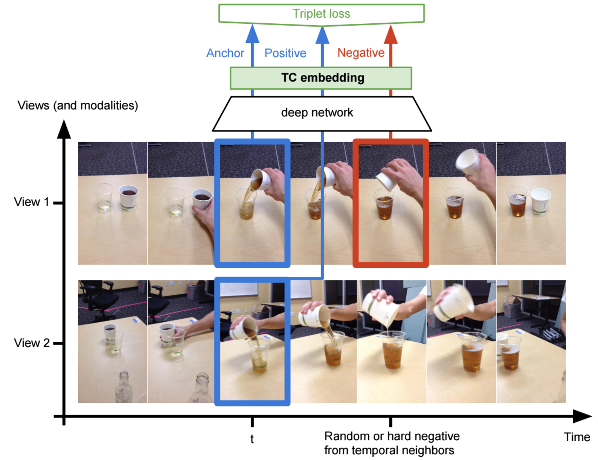

# Time-Contrastive Networks:  Self-Supervised Learning from Multi-View Observation

# Model

# Unsupervised Objects Interactions

### Training Sequences

### Semantic Alignment / Nearest Neighbor Imitation

### 'Fake' pouring imitation

### Imitation Errors

### Robotic Imitation (end-effector never seen during training)

# End-to-End Self-Supervised Pose Imitation

### Self-supervised only (no labels)

### Complex non-linear mapping discovered unsupervised (many-to-one joint mapping)

